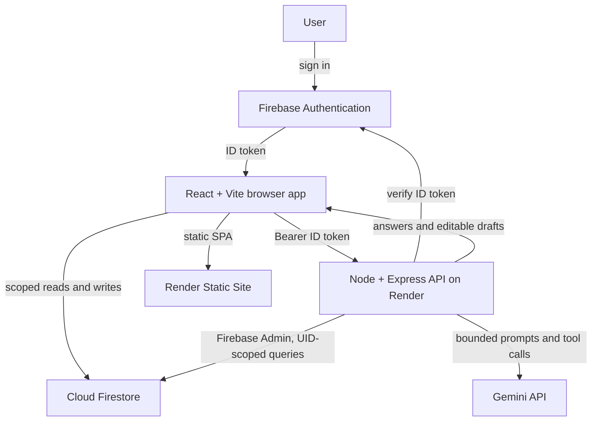

<div align="center">

# FINANCIAL OBSERVATORY

> See where your money goes.

An AI-powered personal finance observatory for understanding what comes in, what goes out, where you spend, and where your money may be heading.

[](https://react.dev/)
[](https://www.typescriptlang.org/)
[](https://vite.dev/)
[](https://nodejs.org/)
[](https://expressjs.com/)
[](https://firebase.google.com/)
[](https://ai.google.dev/)
[](https://render.com/)

[](https://smart-expense-tracker-1-2lsb.onrender.com)
[](https://github.com/tanmayyyyayyy/Smart-Expense-Tracker)
[](https://smart-expense-tracker-q1sh.onrender.com/health)

<br />

[Live Demo](#live-product) &nbsp;•&nbsp; [Dashboard](#financial-dashboard) &nbsp;•&nbsp; [Architecture](#architecture) &nbsp;•&nbsp; [Local Setup](#local-development)

</div>

---

## The Idea

Most expense trackers answer **“What did I spend?”** Financial Observatory is designed to help answer **“What’s happening with my money?”**

It brings income, spending, budgets, trends, projections, and natural-language questions into one place. The aim is financial visibility that makes everyday decisions easier: understand your habits, notice changes, and compare your current pace with your plans.

```text
Income → Spending → Budgets → Trends → Projections → Decisions
```

Financial calculations come from explicit application logic. AI helps interpret questions and prepare drafts; it does not replace financial records or provide professional financial advice.

## Live Product

| Service | URL |
| --- | --- |
| Frontend | [smart-expense-tracker-1-2lsb.onrender.com](https://smart-expense-tracker-1-2lsb.onrender.com) |
| Backend API | [smart-expense-tracker-q1sh.onrender.com](https://smart-expense-tracker-q1sh.onrender.com) |
| Health check | [`GET /health`](https://smart-expense-tracker-q1sh.onrender.com/health) |
| Repository | [github.com/tanmayyyyayyy/Smart-Expense-Tracker](https://github.com/tanmayyyyayyy/Smart-Expense-Tracker) |

The frontend is a React/Vite single-page app deployed as a Render Static Site. The Node/Express API runs as a Render Web Service. Firebase Authentication and Firestore provide sign-in and financial data storage; AI requests go through the backend.

## Product Preview

> Product screenshots coming soon.

## What Financial Observatory Does

### Financial Dashboard

See Money In, Money Out, and Money Left alongside category spending, recent transactions, budget context, daily activity, period comparisons, and weekly AI insights.

### Quick Add

Financial Observatory Quick Add is a mobile-first PWA experience designed for recording expenses in seconds.

### Transactions & Ledger

Record income and expenses with an amount, category, date, payment method, and description. Search, filter, and sort the ledger, then edit or delete entries. Quick entry can parse natural-language transaction descriptions into editable drafts.

### Budgets

Set monthly category limits and compare them with recorded spending. Budget views show headroom and status indicators; onboarding also saves a monthly income and overall budget to the user's profile.

### Spending Prediction

Explore an arithmetic month-end run-rate estimate based on recorded activity and income. Interactive overall and category-level scenarios show how changed spending could affect the estimate. It is a scenario projection, not a machine-learned forecast.

### Ask Your Money

Ask natural-language questions about your own spending, budgets, recent transactions, and trends. For example:

> “What did I spend this month?” · “Where am I spending the most?” · “How is my spending trending?”

The assistant calls controlled backend tools for deterministic spending, budget, trend, and recent-transaction summaries, then explains the results in plain language. The AI feature is opt-in in Settings.

### Receipt Scanning

Upload a receipt or UPI screenshot to prepare a transaction draft. Review and edit the extracted type, amount, date, merchant, category, and payment method before saving.

### Savings Goals

Describe a goal in text to prepare a draft name, target amount, and date. Review and edit the draft before confirming it. Saved goals show progress and a monthly target calculated from the confirmed numbers.

### Statement Import

Read CSV or text-based PDF statements in the browser. Review, edit, or remove parsed rows before confirming their import as transactions. The statement feature reads files locally in the browser.

## AI, Without Giving AI Control of Your Money

Gemini requests go through the Node/Express backend. The Gemini API key stays in server-side configuration; the frontend calls the API with the signed-in user's Firebase ID token.

- Backend middleware verifies Firebase ID tokens and derives the user ID from the verified token.
- AI endpoints require the user's AI preference to be enabled.
- A Firestore-backed shared limit allows up to 20 AI requests per user per hour.
- Ask Your Money uses a fixed set of backend tools. They query the authenticated user's records and return bounded summaries or a limited set of recent entries.
- AI returns explanations and drafts. Transactions and savings goals require user review and confirmation before they are written to Firestore.
- Dashboard summaries and forecasts use deterministic application calculations; model output is not the source of truth for financial totals.
- Prompts and receipt images are sent to Gemini for the requested operation. Avoid submitting information you do not want processed by that service.

## Architecture



Firestore data is stored under `users/{uid}` and that user's subcollections. The checked-in Firestore rules restrict client access to the matching authenticated user. The backend uses Firebase Admin to verify identity and read the same user-scoped records. `firebase.json` also retains Firebase Hosting and Functions configuration, while the current Render deployment is defined in `render.yaml`.

## Built With

| Area | Technologies |
| --- | --- |
| Frontend | React 19, TypeScript, Vite, React Router, vanilla CSS, Recharts, Framer Motion, Lucide React |
| Backend | Node.js 20, Express 4, TypeScript |
| Data & auth | Firebase Authentication, Cloud Firestore, Firebase Admin SDK |
| AI | Gemini API, server-side orchestration and financial query tools |
| Statement parsing | Browser-side CSV parsing and PDF.js |
| Deployment | Render Static Site and Render Web Service |

## Engineering Principles

- Keep financial summaries and forecasts deterministic.
- Keep Gemini and Firebase Admin credentials on the server.
- Scope backend data access to the verified user's UID and enforce user-scoped Firestore rules.
- Require user review before AI-prepared financial records or goal drafts are saved.
- Bound AI inputs, tool outputs, and per-user request volume.
- Return controlled errors when Firebase or AI requests fail.
- Build responsive interfaces with accessible controls and respect reduced-motion preferences where motion is used.

## Project Structure

```text
Smart-Expense-Tracker/
├── app/                    # React + Vite application
│   └── src/
│       ├── components/     # Dashboard, chat, import, goal, and transaction UI
│       ├── context/        # Auth, profile, transaction, budget, and AI preferences
│       ├── firebase/       # Firebase clients and API client
│       ├── pages/          # Dashboard, ledger, budgets, prediction, and account screens
│       └── utils/          # Financial calculations and formatting
├── server/                 # Express API deployed to Render
│   └── src/
│       ├── ai/             # Gemini orchestration, data tools, validation, and rate limiting
│       └── routes/         # Authenticated AI endpoints
├── functions/              # Firebase Functions configuration retained in repository
├── render.yaml             # Render frontend and API services
├── firebase.json           # Firebase Hosting and Functions configuration
├── firestore.rules         # User-scoped Firestore access rules
└── README.md
```

## Local Development

### Requirements

- Node.js 20 or newer
- npm
- Firebase project configuration for Authentication and Firestore

### Frontend

```bash
git clone https://github.com/tanmayyyyayyy/Smart-Expense-Tracker.git
cd Smart-Expense-Tracker
npm --prefix app ci
cp app/.env.example app/.env
npm --prefix app run dev
```

Set the `VITE_FIREBASE_*` values and `VITE_API_BASE_URL` in `app/.env` using your Firebase web app configuration and local API URL (for example, `http://localhost:5001`). These configure the browser application; do not put Gemini or Firebase Admin credentials there.

### Backend

```bash
npm --prefix server ci
cp server/.env.example server/.env
npm --prefix server run dev
```

Set `GEMINI_API_KEY`, `FIREBASE_PROJECT_ID`, and Firebase Admin credentials in `server/.env`. The example supports a service-account JSON value or individual client-email/private-key variables. Keep real credentials out of Git. The API defaults to `http://localhost:5001`; `npm --prefix server run build` creates the production build and `npm --prefix server start` runs it.

## Deployment

`render.yaml` defines two services:

- **Frontend:** Render Static Site, rooted at `app`, built with `npm install && npm run build`, published from `dist`, with SPA route fallback.
- **Backend:** Render Web Service, rooted at `server`, built with `npm install && npm run build` and started with `npm start`.

Configure `GEMINI_API_KEY` and Firebase Admin credentials as Render secrets. The frontend receives its Firebase web configuration and API base URL as build-time environment variables. Firebase Authentication and Firestore remain the identity and data services.

## Security

- Firebase Authentication protects signed-in app features; the backend verifies Firebase ID tokens before AI routes run.
- Firestore rules scope client reads and writes to the matching authenticated UID.
- Gemini and Firebase Admin credentials are configured server-side and must not be committed.
- AI endpoints require opt-in and use a shared per-user rate limit.
- Financial tools query only the verified user's records and return bounded results.
- AI-extracted transactions and goals remain drafts until the user reviews and confirms them.
- Statement files are parsed in the browser and are not uploaded by the statement-import feature.

## Roadmap

Future ideas, not claims about current functionality:

- Broader trend comparisons and more useful spending explanations.
- More flexible forecasting scenarios.
- Support for additional statement formats and improved import mapping.
- Richer progress views for savings goals.
- Clearer context in AI-generated explanations.

## Disclaimer

Financial Observatory is a personal finance tracking and visualization tool. AI-generated responses are informational and should not be treated as professional financial advice.

## Built to make money easier to understand.

Financial Observatory turns everyday financial activity into a picture you can reason about.

[GitHub](https://github.com/tanmayyyyayyy/Smart-Expense-Tracker) &nbsp;•&nbsp; [Live Demo](https://smart-expense-tracker-1-2lsb.onrender.com)
