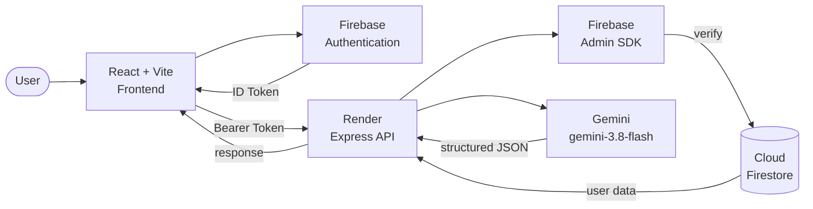

# Financial Observatory


> **See where your money goes.**

Financial Observatory is an AI-powered personal finance platform. It gives you a clear picture of your money — what comes in, what goes out, where it goes, and where it is heading. An AI assistant lets you ask questions about your finances in plain language and helps you add transactions, parse receipts, and set savings goals faster.

---

## Live Product

| Service | URL |
|---|---|
| **Frontend** | https://smart-expense-tracker-1-2lsb.onrender.com |
| **Backend API** | https://smart-expense-tracker-q1sh.onrender.com |
| **Health check** | `GET /health` → `{"ok":true,"service":"financial-observatory-api"}` |

Both services run on Render. The frontend is a static React/Vite SPA. The backend is a Node/Express API that handles AI requests with Firebase Admin authentication.

---

## Product Preview

Screenshots can be added here once captured from the live environment.

```
app/src/assets/   ← place screenshots here and reference them below:

```

---

## Why Financial Observatory

| | |
|---|---|
| **Understand** | Track money coming in and going out. See your net position at a glance. |
| **See** | Visualize spending by category, period, and trend with interactive charts. |
| **Plan** | Set category budgets, track progress, and forecast future spending. |
| **Ask** | Ask questions about your finances in plain language using the AI assistant. |

---

## Core Features

### Financial Dashboard

- **Money In / Money Out / Money Left** — three primary financial metrics computed from recorded transactions and your income profile
- Spending summary cards with period filtering
- Category breakdown chart
- Recent transaction activity feed
- AI-generated weekly spending insights

### Transaction Management

- Add expenses and income with categorization, date, payment method, and merchant
- Full transaction ledger with search and filter
- Edit and delete transactions
- Statement import — upload a bank/UPI statement PDF and extract transactions (PDF.js + AI parsing)
- Natural-language transaction entry — describe a transaction in plain text and the AI parses the details for confirmation before saving

### Budgets

- Set per-category spending budgets
- Real-time budget progress tracking (spent vs. limit)
- Visual status indicators (on track / approaching / over)
- Budget-aware insights on the dashboard

### Spending Prediction

- Forecasted spending based on historical transaction data
- Trend visualization across time periods
- Dedicated prediction page with chart breakdowns

### AI Financial Assistant — Ask Your Money

A conversational panel accessible from the navigation bar and the command palette (`⌘K`).

- Ask questions about your spending, budgets, and trends in plain language
- The assistant calls server-side financial data tools before answering — spending summaries, budget status, category trends, transaction lookups
- Supports multi-turn conversation within a session (up to 8 turns)
- AI-assisted receipt scanning — upload a receipt image and the assistant extracts merchant, amount, date, and category for your review
- AI-assisted savings goal creation — describe a goal in plain text, the assistant parses name, target amount, and target date
- **All AI interaction is opt-in** — disabled by default, enabled in Settings
- **AI never directly saves financial records** — parsed transactions and goals are shown for user confirmation before being written to Firestore

---

## AI Architecture

All AI requests are routed through the Render backend. The Gemini API key never reaches the browser.

```
Browser
  │
  ├─ Firebase Authentication (Google / Email)
  │     └─ Firebase ID Token
  │
  └─ POST /api/ai/* (Render backend)
        │
        ├─ Firebase Admin SDK — verifies ID token, derives UID
        │
        ├─ AI opt-in check (Firestore user preference)
        │
        ├─ Server-side rate limiter (per-user, in-memory)
        │
        ├─ Firestore — reads user's financial data
        │
        ├─ Gemini API (gemini-3.8-flash) — structured JSON output
        │
        └─ Validated response → Frontend
```

**Security model:**

- Gemini API credentials are stored as Render environment secrets — never committed, never sent to the client
- Every AI endpoint requires a valid Firebase ID token (`Authorization: Bearer <token>`)
- The backend derives the authenticated user's UID from the verified token — no client-supplied UID is trusted
- AI is disabled by default per user account; users enable it explicitly in Settings
- AI output is validated against a strict JSON schema before being returned
- AI does not mutate financial data — parsed results require explicit user confirmation before saving

---

## Tech Stack

| Layer | Technology | Version |
|---|---|---|
| Frontend framework | React | 19 |
| Language | TypeScript | 6 |
| Build tool | Vite | 8 |
| Routing | React Router | 7 |
| Charts | Recharts | 3 |
| Animation | Framer Motion | 13 |
| Icons | Lucide React | latest |
| PDF parsing | PDF.js (pdfjs-dist) | 6 |
| Backend runtime | Node.js | 20 |
| Backend framework | Express | 4 |
| Authentication | Firebase Authentication | — |
| Database | Cloud Firestore | — |
| Admin SDK | Firebase Admin | 13 |
| AI model | Gemini (REST API) | gemini-3.8-flash |
| Deployment | Render | — |

---

## Architecture



---

## Local Development

### Prerequisites

- Node.js 20+
- A Firebase project with Authentication and Firestore enabled
- A Gemini API key

### 1. Clone

```bash
git clone https://github.com/tanmayyyyayyy/Smart-Expense-Tracker.git
cd Smart-Expense-Tracker
```

### 2. Backend

```bash
cd server
cp .env.example .env          # fill in GEMINI_API_KEY and FIREBASE_SERVICE_ACCOUNT_JSON
npm install
npm run dev                   # http://localhost:5001
```

### 3. Frontend

```bash
cd app
cp .env.example .env          # fill in VITE_FIREBASE_* and VITE_API_BASE_URL
npm install
npm run dev                   # http://localhost:5173
```

See [`server/.env.example`](server/.env.example) and [`render.yaml`](render.yaml) for the full list of required variables. Never commit `.env` files or service account JSON.

---

## API Reference

All AI endpoints require a valid Firebase ID token in the `Authorization: Bearer <token>` header.

| Method | Path | Description |
|---|---|---|
| `GET` | `/health` | Liveness check — no auth required |
| `POST` | `/api/ai/parse-transaction` | Parse natural-language transaction text |
| `POST` | `/api/ai/scan-receipt` | Extract transaction data from a receipt image |
| `POST` | `/api/ai/parse-goal` | Parse a savings goal from plain text |
| `POST` | `/api/ai/weekly-insight` | Generate a weekly spending insight summary |
| `POST` | `/api/ai/ask` | Conversational financial assistant (Ask Your Money) |

---

## Project Structure

```
Smart-Expense-Tracker/
├── app/                          # React/Vite frontend (static site)
│   └── src/
│       ├── pages/                # Route-level page components
│       │   ├── Dashboard.tsx
│       │   ├── Budgets.tsx
│       │   ├── Ledger.tsx
│       │   ├── Prediction.tsx
│       │   ├── Settings.tsx
│       │   ├── AddExpense.tsx
│       │   ├── Onboarding.tsx
│       │   ├── Landing.tsx
│       │   ├── Login.tsx
│       │   └── Signup.tsx
│       ├── components/           # Shared UI components
│       │   ├── AskYourMoney.tsx
│       │   ├── QuickAddModal.tsx
│       │   ├── CommandPalette.tsx
│       │   ├── StatementImport.tsx
│       │   ├── GoalPlanner.tsx
│       │   ├── SpendingChart.tsx
│       │   ├── CategoryBreakdown.tsx
│       │   ├── MetricCard.tsx
│       │   └── Navbar.tsx
│       ├── context/              # React context providers
│       ├── firebase/             # Firebase SDK initialization
│       └── utils/                # Utility functions
├── server/                       # Node/Express backend (Render web service)
│   └── src/
│       ├── ai/
│       │   ├── gemini.ts         # Gemini REST client
│       │   ├── features.ts       # AI feature handlers
│       │   ├── financialTools.ts # Firestore data tools for the AI assistant
│       │   ├── schemas.ts        # JSON output schemas and validators
│       │   ├── security.ts       # Auth + AI opt-in + rate limit middleware
│       │   └── rateLimit.ts      # Per-user in-memory rate limiter
│       ├── routes/
│       │   └── ai.ts             # Express router for /api/ai/*
│       ├── firebase.ts           # Firebase Admin initialization
│       └── index.ts              # Express app entry point
├── render.yaml                   # Render infrastructure definition
├── firestore.rules               # Firestore security rules
└── firebase.json                 # Firebase project config
```

---

## Deployment

The project deploys automatically to Render on every push to `main`.

- **Frontend** — built as a static site (`npm run build` in `app/`), served with SPA fallback rewrites so all routes resolve to `index.html`
- **Backend** — TypeScript compiled to `dist/` (`npm run build` in `server/`), started with `node dist/index.js`

Environment secrets (Gemini API key, Firebase service account) are configured as Render secret environment variables and are never committed to the repository.

---

## Firestore Security

User data is scoped per authenticated user under `users/{uid}/`. Firestore security rules enforce that users can only read and write their own documents. The backend reads Firestore via Firebase Admin SDK — access is still gated by the server's own authentication and authorization layer before any Firestore query is made.

---

## Contributing

See [CONTRIBUTING.md](CONTRIBUTING.md).

---

*Financial Observatory is a personal finance tool. It does not constitute financial advice.*
